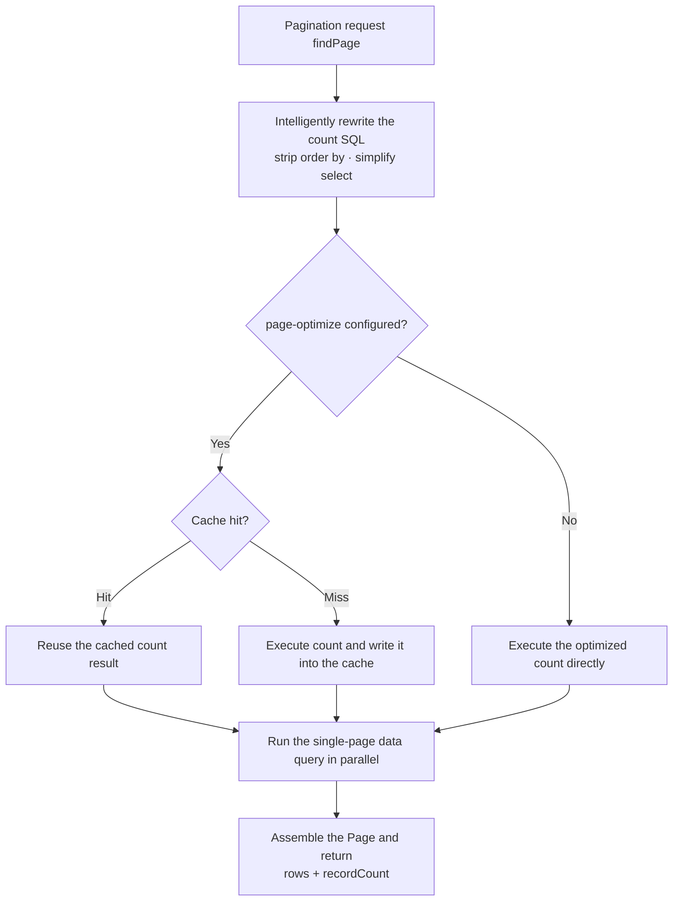

# Pagination Optimize

sqltoy provides the industry's most complete pagination mechanism: **intelligent count optimization, cached pagination, fast pagination, and parallel pagination**, and also supports custom count SQL and skipping count. Developers do not need to worry about pagination dialect differences across databases — sqltoy adapts automatically.

Overall flow:



## 1. Basic Pagination API

```java
// 1) paginated query with Map parameters
Page<SysLog> page = lightDao.findPage(new Page(10, 1), "sys_log_find", paramsMap, SysLog.class);

// 2) flexible pagination with QueryExecutor (datasource, cache translate, formatting, pagination optimize, etc. can be specified)
QueryResult result = lightDao.findPageByQuery(new Page(10, 1),
        new QueryExecutor("sys_log_find").names("status").values(1).resultType(SysLog.class));

// 3) single-table entity pagination
Page<SysLog> page2 = lightDao.findPageEntity(new Page(10, 1), SysLog.class,
        EntityQuery.create().where("status=:status").names("status").values(1));
```

> `Page` is constructed as `new Page(pageSize, pageNo)`; for example `new Page(10, 1)` means 10 rows per page, page 1.

Common `Page` methods:

| Method | Description |
| --- | --- |
| `getRows()` | Data collection of the current page |
| `getRecordCount()` | Total record count |
| `getPageNo()` / `getPageSize()` | Current page number / rows per page |
| `getTotalPage()` / `getLastPage()` | Total pages / last page number |
| `getNextPage()` / `getPriorPage()` / `getFirstPage()` | Next page / previous page / first page |
| `getStartIndex()` / `getNextIndex()` / `getPreviousIndex()` | Start / next / previous index |
| `setSkipQueryCount(Boolean)` | Whether to skip the total count query (see Section 6) |
| `setOverPageToFirst(Boolean)` | Whether to return to the first page when paging goes beyond the last page |

---

## 2. Intelligent Count Optimization (Automatic)

Pagination is essentially a two-step query: **① query the total record count, ② query the data of a specific page**. The count query is often the performance bottleneck of pagination on large tables.

sqltoy's count is **not** a blunt `select count(1) from (your sql) as t`; instead it intelligently rewrites:

- **Strips unnecessary `order by`** clauses according to the SQL logic;
- Detects whether the `select` columns and function expressions before `from` in the original SQL can be **directly cut away**, replaced with `select count(1) from ...`, avoiding pointless function evaluation;
- Automatically adapts to the pagination dialect of each database (limit / rownum / offset fetch / top, etc.).

In the vast majority of scenarios, this automatic optimization already significantly reduces the count overhead with no extra configuration.

---

## 3. Cached Pagination (page-optimize)

For scenarios where **the query conditions are identical and paging happens frequently**, re-running count on every page turn is wasteful. `<page-optimize>` caches "identical query conditions → count result" so that, within a certain period, paging directly reuses the count without querying the total again.

```xml
<sql id="sys_log_find">
    <!-- parallel: whether to execute the count and the single-page data query in parallel;
         alive-max: how many groups of counts for different query conditions can be cached at most; alive-seconds: cache survival seconds -->
    <page-optimize parallel="true" alive-max="100" alive-seconds="120" />
    <value><![CDATA[
        select t.* from sqltoy_staff_info t
        where t.STATUS=1
        #[and t.STAFF_NAME like :staffName]
        order by t.ENTRY_DATE desc
    ]]></value>
</sql>
```

`<page-optimize>` attributes:

| Attribute | Default | Description |
| --- | --- | --- |
| `parallel` | `false` | Whether to execute the count and the result query in parallel for better efficiency (cache optimization is disabled when `alive-max=1`) |
| `parallel-maxwait-seconds` | — | Maximum wait seconds for the parallel query, to avoid running too long |
| `alive-max` | `100` | Maximum number of count records cached for different query conditions |
| `alive-seconds` | `90` | Survival seconds in memory for each group of query conditions and its count; when expired it is queried again |
| `skip-zero-count` | `false` | Whether to automatically re-fetch when the count is 0 |

The Java counterpart is `QueryExecutor.pageOptimize(PageOptimize)`:

```java
lightDao.findPageByQuery(new Page(10, 1),
        new QueryExecutor("sys_log_find").pageOptimize(new PageOptimize(100, 120)));
```

---

## 4. Fast Pagination (@fast / @fastPage)

**Paginate first, then join**: when the main query needs to join other tables (especially one-to-many), the usual approach is to join into a large result set first and then paginate, which is expensive. `@fast()` wraps the part that "determines the result set" in a subquery, **first takes the paginated records by pageSize, then joins with the other tables**, greatly reducing the amount of joined data.

```xml
<sql id="sys_log_findlist">
    <value><![CDATA[
        select t1.*,t2.ORGAN_NAME
        -- @fast() first takes pageSize rows by pagination, then joins
        from @fast(
              select t.* from sqltoy_staff_info t
              where t.STATUS=1
                #[and t.STAFF_NAME like :staffName]
              order by t.ENTRY_DATE desc
             ) t1
        left join sqltoy_organ_info t2 on t1.organ_id=t2.ORGAN_ID
    ]]></value>
</sql>
```

Key points:

- `@fast` and `@fastPage` are **equivalent**.
- `@fast()` is written directly in the SQL; for **non-paginated queries the framework automatically removes `@fast`**, so it does not affect other queries such as find/findTop.
- It also applies to `findTop` and `findRandom` (getRandomResult).
- It can be combined with extracting 1..n times the data: e.g. with `pageSize=10`, take 50 rows and then perform row-to-column pivoting and other secondary computation.

---

## 5. Parallel Pagination (parallel)

With `<page-optimize parallel="true">`, sqltoy **executes the count query and the single-page data query in parallel**, compressing the originally serial two steps into the duration of one, suitable for scenarios where both the count and the data query are heavy. Use `parallel-maxwait-seconds` to limit the maximum parallel wait time.

---

## 6. Custom count-sql and Skipping Count

**Custom count SQL**: in extremely special cases, you can hand-write the optimal count statement:

```xml
<sql id="sys_log_find">
    <value><![CDATA[ select ... complex query ... ]]></value>
    <count-sql><![CDATA[ select count(1) from sqltoy_staff_info t where t.STATUS=1 ]]></count-sql>
</sql>
```

**Skipping count**: for scenarios that do not need the total, such as scroll loading and infinite dropdowns, the count query can be skipped to improve performance:

```java
Page page = new Page(20, 1);
page.setSkipQueryCount(true);   // do not query the total record count
Page result = lightDao.findPage(page, "sys_log_find", paramsMap, SysLog.class);
```

---

> For pagination-related source code, refer to `org.sagacity.sqltoy.dialect.PageOptimizeUtils` (the count optimization and fast pagination engine) and the `Dialect` implementations of the individual databases.
