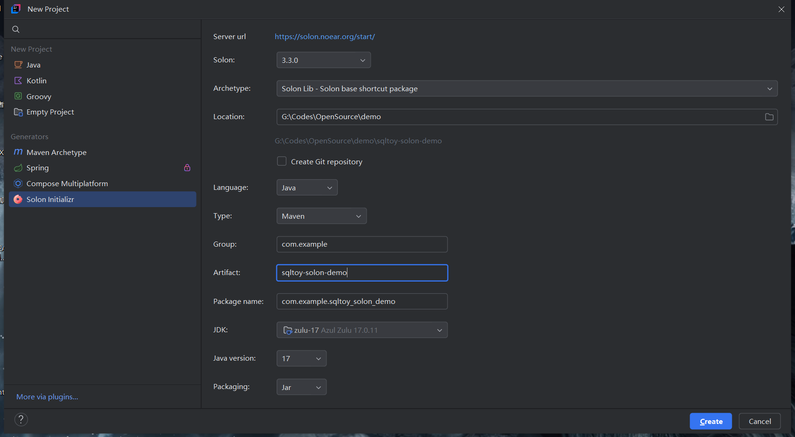

# Integrating SqlToy with Solon


## 1. Create the project

- Open your IDE (IntelliJ IDEA or Eclipse) and create a Maven project. Here the IDEA Solon plugin is used.
- Demo project: [sqltoy-solon-demo](https://github.com/CoCoTeaNet/sqltoy-solon-demo)




## 2. Add dependencies

- sqltoy Solon plugin

```xml
<!--sqltoy-solon-->
<dependency>
    <groupId>com.sagframe</groupId>
    <artifactId>sagacity-sqltoy-solon-plugin</artifactId>
    <version>LATEST</version>
</dependency>
```

- MySQL connector

```xml
<!-- mysql connector -->
<dependency>
    <groupId>com.mysql</groupId>
    <artifactId>mysql-connector-j</artifactId>
    <version>9.7.0</version>
    <scope>runtime</scope>
</dependency>
```

## 3. Configure the data source

- app.yml

```yaml
myapp:
  db1:
    schema: demo
    jdbcUrl: jdbc:mysql://127.0.0.1:3306/demo?useUnicode=true&characterEncoding=utf-8&useSSL=true&serverTimezone=Asia/Shanghai&tinyInt1isBit=false
    driverClassName: com.mysql.cj.jdbc.Driver
    username: root
    password: root
```

- Inject the datasource configuration (DbConfig.java)

```java
@Configuration
public class DbConfig {
    @Bean(name = "db1", typed = true)
    public DataSource db1(@Inject("${myapp.db1}") HikariDataSource ds) {
        return ds;
    }
}
```

HikariDataSource is used as the connection pool, so one extra dependency is needed:
```xml
<!-- connection pool -->
<dependency>
    <groupId>com.zaxxer</groupId>
    <artifactId>HikariCP</artifactId>
</dependency>
```

- Then the sqltoy configuration

```yaml
sqltoy:
  # scan path for the sql xml files
  sqlResourcesDir: classpath:sqltoy
  debug: true
```

## 4. Use the sqltoy API in Solon

1. Create a controller for testing (TestController.java)

```java
@Controller
public class TestController {
    @Db
    private LightDao lightDao;

    @Get
    @Mapping("/order/findAll")
    public Object query() {
        return lightDao.find("findAll", new HashMap<>());
    }
}
```

2. Create the template sql (sqltoy/sqltoy_order_info.sql.sql.xml)

```xml
<?xml version="1.0" encoding="utf-8"?>
<sqltoy xmlns="http://www.sagframe.com/schema/sqltoy"
        xmlns:xsi="http://www.w3.org/2001/XMLSchema-instance"
        xsi:schemaLocation="http://www.sagframe.com/schema/sqltoy http://www.sagframe.com/schema/sqltoy/sqltoy.xsd">

    <sql id="sqltoy_order_info_find">
        <value>
            <![CDATA[
            select *
            from sqltoy_order_info
            order by ORDER_ID desc
            ]]>
        </value>
    </sql>

</sqltoy>
```

## 5. Run and test

1. Run the application (App.java)
2. Open: ```http://localhost:8080/order/findAll```
