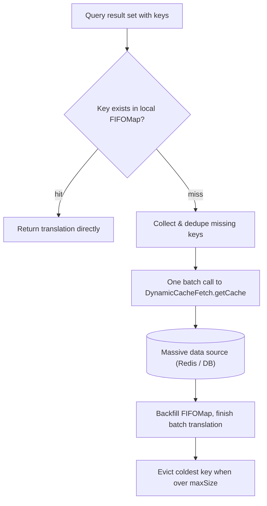

# Large-Scale Cache (FIFO)

Cache Translate typically **loads the full cache in one go** after startup, which is very efficient for small-to-medium data such as dictionaries and organizations. However, in scenarios like platform e-commerce SKUs, administrative divisions plus house numbers, or phone-number location lookup, the data volume can reach **the millions or even tens of millions**, while the actually high-frequency entries are often only tens of thousands to a little over a hundred thousand — full loading both slows down startup and consumes a large amount of memory.

For such scenarios, sqltoy provides a **dynamic cache** mechanism: locally it keeps only a bounded `FIFOMap` (e.g., at most 100,000 entries); during translation, keys missing from the cache are **loaded on demand in batches** through the `DynamicCacheFetch` interface. Frequently used data is automatically retained, and rarely used data is automatically evicted.

> [!NOTE]
> The batch fetch interface `getCache(..., String[] keys)` and the default cache manager `FIFODynamicFetchCacheManager` are provided since version **5.6.67** (see the [5.6.67 release notes](https://gitee.com/sagacity/sagacity-sqltoy/releases) for details).

## 1. How It Works



Key design points:

1. **Locally bounded cache**: `FIFOMap` works in `accessOrder` mode; every `get` moves the entry to the tail of the queue (effectively extending its life), and when capacity exceeds `maxSize`, the least-recently-used entry at the head is evicted — a natural match with the real-world pattern that "frequently used data concentrates";
2. **Batch fetching**: all keys missed in one query result set are **deduplicated and passed to the interface in a single call**, so the whole batch requires only one IO round trip, avoiding the performance disaster of per-row queries;
3. **Multi-level storage**: implementations of `DynamicCacheFetch` usually query a distributed cache such as Redis first and then fall back to the database, forming a multi-level structure of "local FIFOMap → Redis → DB".

## 2. Usage Steps (Three Steps)

### Step 1: Define the dynamic cache (sqltoy-translate.xml)

```xml
<?xml version="1.0" encoding="UTF-8"?>
<sagacity xmlns="https://www.sagframe.com/schema/sqltoy-translate"
    xmlns:xsi="https://www.w3.org/2001/XMLSchema-instance"
    xsi:schemaLocation="https://www.sagframe.com/schema/sqltoy-translate
    https://sagframe.github.io/schema/sqltoy-translate.xsd">
    <cache-translates>
        <!-- dynamic cache: no full loading; missed keys are fetched on demand in batches via DynamicCacheFetch -->
        <local-translate cache="skuDict" sid="SKU_CACHE" properties="id,name,brand"
            keep-alive="3600" dynamic-cache="true" dynamic-cache-maxSize="100000" />
    </cache-translates>
</sagacity>
```

Description of the `local-translate` attributes:

| Attribute | Description | Default |
| --- | --- | --- |
| `cache` | Cache name, referenced via `cache="xxx"` at the usage site | Required |
| `dynamic-cache` | Enables the dynamic fetch mode | false |
| `dynamic-cache-initSize` | Initial capacity of the FIFOMap | 10000 |
| `dynamic-cache-maxSize` | Maximum capacity of the FIFOMap; the least-recently-used data is evicted beyond it | 100000 |
| `dynamic-cache-loadFactor` | Map load factor | 0.75 |
| `keep-alive` | Data time-to-live in seconds; **a negative value means valid forever** | default-keep-alive (3600) |
| `sid` | Identifier, passed as-is to the fetch interface (e.g., sqlId), helping a generic implementation distinguish data sources | none |
| `properties` | Property info, passed as-is to the fetch interface (e.g., specifying which columns to return) | none |

### Step 2: Implement the DynamicCacheFetch fetch interface

```java
package org.sagacity.sqltoy.translate;

public interface DynamicCacheFetch {

    /**
     * Initialization method; you can get beans from the container (e.g., redisTemplate)
     * via appContext.getBean(...)
     */
    public void initialize(AppContext appContext);

    /**
     * Gets the cached data of a single key (called in non-batch scenarios such as
     * single-object translation)
     * @return Object[]{key, name1, name2, ...}; returns null if not found
     */
    public Object[] getCache(String cacheName, String cacheType, String sid,
            String[] properties, String key);

    /**
     * Batch fetch (implemented in version 5.6.67, using a batch-query mode to reduce
     * IO round trips)
     * @param keys keys missed in the result set, already deduplicated
     * @return Map<key, Object[]> in the structure {key,[id,name,email]}
     */
    public Map<String, Object[]> getCache(String cacheName, String cacheType, String sid,
            String[] properties, String[] keys);
}
```

Parameter description:

| Parameter | Description |
| --- | --- |
| `cacheName` | Cache name, i.e., the `cache` of `local-translate` |
| `cacheType` | The group type of a dictionary-like cache (has a value when `cache-type` is passed at the usage site); null in non-grouped scenarios |
| `sid` / `properties` | The identifier and properties defined in the cache; passed through as-is so generic implementations can branch on them |
| `key` / `keys` | Cache key(s) to fetch (deduplicated in batch mode) |

Complete implementation example (the same one used in the demo project, which demonstrates fetching from a database; in production, large-scale data usually queries Redis first and then falls back to the database):

```java
public class BigDictDynamicCacheFetch implements DynamicCacheFetch {

    // initialize is called during SqlToyContext initialization, when beans such as
    // LightDao may not be ready yet;
    // calling getBean directly can easily create a circular dependency, so appContext
    // is recorded and lazy loading is used instead
    private AppContext appContext;
    private volatile LightDao lightDao;

    @Override
    public void initialize(AppContext appContext) {
        this.appContext = appContext;
        // If you need to integrate Redis, get it here: appContext.getBean("redisTemplate")
    }

    // The single-key scenario directly reuses the batch logic, avoiding two sets of fetch code
    @Override
    public Object[] getCache(String cacheName, String cacheType, String sid,
            String[] properties, String key) {
        Map<String, Object[]> datas = getCache(cacheName, cacheType, sid,
                properties, new String[] { key });
        return (datas == null) ? null : datas.get(key);
    }

    // Batch fetch: keys missed in one result set are deduplicated and passed in at once
    @SuppressWarnings({ "unchecked", "rawtypes" })
    @Override
    public Map<String, Object[]> getCache(String cacheName, String cacheType, String sid,
            String[] properties, String[] keys) {
        Map<String, Object[]> result = new HashMap<String, Object[]>();
        if (keys == null || keys.length == 0) {
            return result;
        }
        // resultType=Array.class returns rows as Object[] arrays; column 0 is the key
        List rows = getLightDao().find(
                "select DICT_KEY,DICT_NAME,STATUS from sqltoy_dict_detail where DICT_KEY in (:keys)",
                MapKit.map("keys", Arrays.asList(keys)), Array.class);
        for (Object row : rows) {
            Object[] rowData = (Object[]) row;
            result.put(rowData[0].toString(), rowData);
        }
        return result;
    }

    private LightDao getLightDao() {
        if (lightDao == null) {
            synchronized (this) {
                if (lightDao == null) {
                    lightDao = appContext.getBean(LightDao.class);
                }
            }
        }
        return lightDao;
    }
}
```

### Step 3: Register the implementation class

**Spring Boot (sqltoy-spring-boot-starter)**: the value supports a **container bean name** (matched first) or a **fully qualified class name** (instantiated via reflection):

```yml
spring:
    sqltoy:
        dynamicCacheFetch: com.xxx.cache.BigDictDynamicCacheFetch
```

**Traditional Spring (XML-configured) projects**: inject the SqlToyContext property directly:

```xml
<bean id="sqlToyContext" class="org.sagacity.sqltoy.SqlToyContext" init-method="initialize">
    <!-- other properties omitted -->
    <property name="dynamicCacheFetch">
        <bean class="com.xxx.cache.BigDictDynamicCacheFetch" />
    </property>
</bean>
```

## 3. Runtime Mechanism Details

**Batch fetching and two-pass translation**: during the first translation pass over the result set, missed keys are only registered in `DynamicCacheHolder` (a deduplicated set) without issuing any query; after the first pass ends, the framework calls the batch interface to fetch them in one go, and after **backfilling the FIFOMap**, it performs a second pass to batch-write the translations into the unmatched rows. Therefore the whole batch of missed keys incurs only one fetch IO.

**FIFO eviction policy**: `FIFOMap` is implemented on top of `LinkedHashMap(accessOrder=true)`; a `get` hit moves the entry to the tail (extending its life), and a `put` that exceeds `maxSize` evicts the least-recently-used entry at the head. `get/put/remove` are all synchronized, making it safe under concurrent multi-threaded translation.

**keep-alive expiration**: it takes effect for the whole group of "cache name + cacheType" — timing starts from when the group's data is initialized; after `keep-alive` seconds, a background daemon thread (checking once every 3 minutes) clears the whole group, and it is dynamically reloaded on next use; a negative value means it never expires.

**Cooperation with cache-update-checker incremental updates**: the dynamic cache can also be configured with a [cache update checker](../quickstart/translates.md), but on update **only keys that already exist locally are overwritten** — keys that were not loaded have no old value locally and naturally get the latest data the next time they are dynamically fetched.

**Zero awareness on the usage side**: the way translation is referenced is exactly the same as for a normal cache — whether it is `<translate cache="skuDict" ... />` in the sql xml or `@Translate(cache="skuDict")` on a VO — without any extra code.

## 4. [Optional] Custom DynamicFecthCacheManager

Storage management of the dynamic cache is handled by the `DynamicFecthCacheManager` interface (`Fecth` in the interface name is a historical spelling in the source code). The framework provides a default FIFOMap-based `org.sagacity.sqltoy.translate.cache.impl.FIFODynamicFetchCacheManager`, and in the vast majority of scenarios there is no need to replace it.

```java
package org.sagacity.sqltoy.translate.cache;

public interface DynamicFecthCacheManager {
    // Get (or lazily create) the dynamic cache Map for the given cache + group
    public HashMap<String, Object[]> getDynamicCache(TranslateConfigModel cacheModel, String cacheType);
    // Whether a cache has been used (lets the update checker decide whether a check is needed)
    public boolean hasCache(String cacheName);
    // Clear the data of a cache (or of one of its groups)
    public void clear(String cacheName, String cacheType);
    // Initialization (the default implementation starts the keep-alive expiration check thread)
    public void initialize();
    // Destruction (the default implementation stops the check thread)
    public void destroy();
}
```

To replace it with a custom implementation:

```yml
spring:
    sqltoy:
        # Also supports a bean name or a fully qualified class name (note the source property name is Fecth)
        dynamicFecthCacheManager: com.xxx.cache.MyDynamicFetchCacheManager
```

## 5. Notes and Cautions

- `dynamic-cache="true"` **must** be accompanied by a registered `DynamicCacheFetch` implementation; if none is registered, the cache degrades to the normal full-loading mode, and since `local-translate` itself has no data source configured, no data can be loaded;
- Column 0 of the `Object[]` returned by the fetch must be the key, and the translation column positions correspond to `cache-indexs` at the usage site (e.g., `Object[]{key, name, status}` corresponds to `cache-indexs="1"`);
- `dynamic-cache-maxSize` should be evaluated against JVM memory: 100,000 entries × about 200 bytes each ≈ on the order of tens of MB; watch the heap limit when multiple large caches are stacked;
- keep-alive expiration clears the whole group, so the first query after a clear triggers a burst of concentrated dynamic fetches; for high-frequency scenarios, it is advisable to increase `keep-alive`, or to combine a negative (permanently valid) setting with the incremental update checker.

## 6. Complete Runnable Example

> 🎬 For the complete example, see the demo project `sqltoy-showcase`: `BigDictDynamicCacheFetch.java` (the fetch implementation), `DynamicCacheTest.java` (translation + FIFOMap cache volume verification), the `bigDictCache` definition in `sqltoy-translate.xml`, and the registration in `spring-sqltoy.xml`.

## Related Pages

- [Cache Translate usage](../quickstart/translates.md): basic configuration of Cache Translate and various additional usages
- [Dynamic Cache Control](dynamic_cache.md): dynamically extend and refresh caches at runtime via `TranslateManager`
