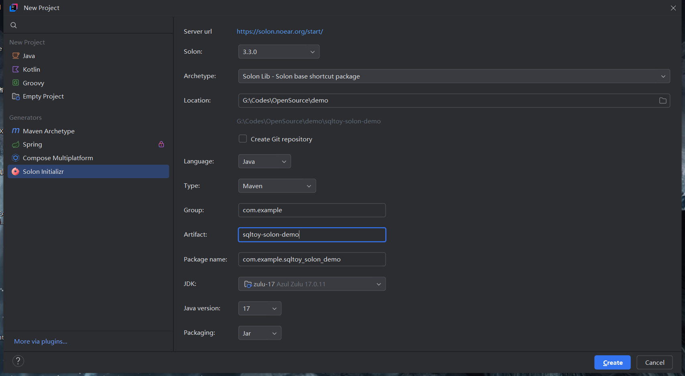

# Sqltoy集成到Solon案例


## 一、创建项目

- 打开 IDE（如 IntelliJ IDEA 或 Eclipse），选择创建 Maven 项目。这里直接使用idea solon插件创建。
- 案例地址：[sqltoy-solon-demo](https://github.com/CoCoTeaNet/sqltoy-solon-demo)




## 二、添加依赖

- sqltoy-solon插件

```xml
        <!--sqltoy-solon-->
        <dependency>
            <groupId>com.sagframe</groupId>
            <artifactId>sagacity-sqltoy-solon-plugin</artifactId>
            <version>最新版</version>
        </dependency>
```

- MySQL连接器

```xml
        <!-- mysql连接器 -->
        <dependency>
            <groupId>com.mysql</groupId>
            <artifactId>mysql-connector-j</artifactId>
            <version>8.3.0</version>
            <scope>runtime</scope>
        </dependency>
```

## 三、配置数据源

- app.yml配置

```yaml
myapp:
  db1:
    schema: demo
    jdbcUrl: jdbc:mysql://127.0.0.1:3306/demo?useUnicode=true&characterEncoding=utf-8&useSSL=true&serverTimezone=Asia/Shanghai&tinyInt1isBit=false
    driverClassName: com.mysql.cj.jdbc.Driver
    username: root
    password: root
```

- 注入数据源配置(DbConfig.java)

```java
@Configuration
public class DbConfig {
    @Bean(name = "db1", typed = true)
    public DataSource db1(@Inject("${myapp.db1}") HikariDataSource ds) {
        return ds;
    }
}
```

连接池这里用了HikariDataSource，因此要多加个依赖：
```xml
<!-- 连接池 -->
<dependency>
    <groupId>com.zaxxer</groupId>
    <artifactId>HikariCP</artifactId>
</dependency>
```

- 然后是sqltoy的配置

```yaml
sqltoy:
  # xml中的sql扫描路径
  sqlResourcesDir: classpath:sqltoy
  debug: true
```

## 四、在solon中使用sqltoy的api

1. 先创建个Controller调试（TestController.java）

```java
@Controller
public class TestController {
    @Db
    private LightDao lightDao;

    @Get
    @Mapping("/order/findAll")
    public Object query() {
        return lightDao.find("findAll", new HashMap<>());
    }
}
```

2. 创建模板sql（sqltoy/sqltoy_order_info.sql.sql.xml）

```xml
<?xml version="1.0" encoding="utf-8"?>
<sqltoy xmlns="http://www.sagframe.com/schema/sqltoy"
        xmlns:xsi="http://www.w3.org/2001/XMLSchema-instance"
        xsi:schemaLocation="http://www.sagframe.com/schema/sqltoy http://www.sagframe.com/schema/sqltoy/sqltoy.xsd">

    <sql id="sqltoy_order_info_find">
        <value>
            <![CDATA[
            select *
            from sqltoy_order_info
            order by ORDER_ID desc
            ]]>
        </value>
    </sql>

</sqltoy>
```

## 五、调试

1. 运行程序（App.java）
2. 访问接口：```http://localhost:8080/order/findAll```
