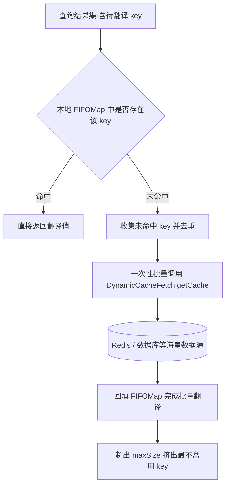

# 超大规模主数据缓存（FIFO 动态缓存）

缓存翻译通常在启动后**一次性全量加载**缓存数据，这对字典、机构这类中小规模数据非常高效。但平台型电商 SKU、行政区划+门牌、号码归属地等场景，数据量达到**百万级甚至千万级**，而真正高频使用的往往只有几万到十几万条——全量加载既拖慢启动又占用大量内存。

sqltoy 针对这类场景提供了**动态缓存**机制：本地只保留一个有界的 `FIFOMap`（如最多 10 万条），翻译时缓存没有的 key 才通过 `DynamicCacheFetch` 接口**按需动态加载**，频繁使用的数据自动保留，不常用的自动被挤出。

> [!NOTE]
> 批量获取接口 `getCache(..., String[] keys)` 与默认缓存管理器 `FIFODynamicFetchCacheManager` 由 **5.6.67** 版本提供（详见 [5.6.67 发行说明](https://gitee.com/sagacity/sagacity-sqltoy/releases)）。

## 一、工作原理



关键设计点：

1. **本地有界缓存**：`FIFOMap` 按 `accessOrder` 模式工作，每次 `get` 都会把条目移到队尾（相当于续命），容量超出 `maxSize` 时挤掉队首最不常用的数据——与真实业务"常用数据集中"的规律天然匹配；
2. **批量取数**：一次查询结果集中所有未命中的 key 会**去重收集后一次性传入**接口，整批只需一次 IO，避免逐行查询的性能灾难；
3. **多级存储**：`DynamicCacheFetch` 的实现里通常先查 Redis 等分布式缓存，没有再回源数据库，形成"本地 FIFOMap → Redis → DB"的多级结构。

## 二、使用步骤（三步）

### 第 1 步：定义动态缓存（sqltoy-translate.xml）

```xml
<?xml version="1.0" encoding="UTF-8"?>
<sagacity xmlns="https://www.sagframe.com/schema/sqltoy-translate"
    xmlns:xsi="https://www.w3.org/2001/XMLSchema-instance"
    xsi:schemaLocation="https://www.sagframe.com/schema/sqltoy-translate
    https://sagframe.github.io/schema/sqltoy-translate.xsd">
    <cache-translates>
        <!-- 动态缓存:不做全量加载,未命中的key通过DynamicCacheFetch按需批量获取 -->
        <local-translate cache="skuDict" sid="SKU_CACHE" properties="id,name,brand"
            keep-alive="3600" dynamic-cache="true" dynamic-cache-maxSize="100000" />
    </cache-translates>
</sagacity>
```

`local-translate` 属性说明：

| 属性 | 说明 | 默认值 |
| --- | --- | --- |
| `cache` | 缓存名称，翻译时通过 `cache="xxx"` 引用 | 必填 |
| `dynamic-cache` | 开启动态获取模式 | false |
| `dynamic-cache-initSize` | FIFOMap 初始容量 | 10000 |
| `dynamic-cache-maxSize` | FIFOMap 最大容量，超出后挤出最不常用的数据 | 100000 |
| `dynamic-cache-loadFactor` | Map 加载因子 | 0.75 |
| `keep-alive` | 数据存活时长（秒），**负数表示永久有效** | default-keep-alive（3600） |
| `sid` | 标识符号，原样传给取数接口（如 sqlId），便于通用型实现区分数据来源 | 无 |
| `properties` | 属性信息，原样传给取数接口（如指定返回哪些列） | 无 |

### 第 2 步：实现 DynamicCacheFetch 取数接口

```java
package org.sagacity.sqltoy.translate;

public interface DynamicCacheFetch {

    /**
     * 初始化方法,可通过 appContext.getBean(...) 获取容器中的bean(如redisTemplate)
     */
    public void initialize(AppContext appContext);

    /**
     * 获取单个key的缓存数据(单对象翻译等非批量场景调用)
     * @return Object[]{key, name1, name2, ...} 未取到返回null
     */
    public Object[] getCache(String cacheName, String cacheType, String sid,
            String[] properties, String key);

    /**
     * 批量获取(5.6.67版本实现,采取批量查询模式,减少IO次数)
     * @param keys 结果集中未命中的key,已去除重复
     * @return Map<key, Object[]>{key,[id,name,email]}结构
     */
    public Map<String, Object[]> getCache(String cacheName, String cacheType, String sid,
            String[] properties, String[] keys);
}
```

参数说明：

| 参数 | 说明 |
| --- | --- |
| `cacheName` | 缓存名称，即 `local-translate` 的 `cache` |
| `cacheType` | 数据字典类的分组类型（使用处传了 `cache-type` 时有值），非分组场景为 null |
| `sid` / `properties` | 缓存定义中的标识与属性，原样透传，供通用型实现分支处理 |
| `key` / `keys` | 待获取的缓存 key（批量模式下已去重） |

完整实现范例（演示项目同款，以数据库演示取数；生产中超大规模数据一般先查 Redis 再回源数据库）：

```java
public class BigDictDynamicCacheFetch implements DynamicCacheFetch {

    // initialize在SqlToyContext初始化阶段被调用,此时LightDao等bean可能尚未就绪,
    // 直接getBean易形成循环依赖,因此记录appContext采用懒加载
    private AppContext appContext;
    private volatile LightDao lightDao;

    @Override
    public void initialize(AppContext appContext) {
        this.appContext = appContext;
        // 如需对接redis,可在此处获取:appContext.getBean("redisTemplate")
    }

    // 单key场景直接复用批量逻辑,避免维护两套取数代码
    @Override
    public Object[] getCache(String cacheName, String cacheType, String sid,
            String[] properties, String key) {
        Map<String, Object[]> datas = getCache(cacheName, cacheType, sid,
                properties, new String[] { key });
        return (datas == null) ? null : datas.get(key);
    }

    // 批量获取:一次结果集中未命中的key去重后一次性传入
    @SuppressWarnings({ "unchecked", "rawtypes" })
    @Override
    public Map<String, Object[]> getCache(String cacheName, String cacheType, String sid,
            String[] properties, String[] keys) {
        Map<String, Object[]> result = new HashMap<String, Object[]>();
        if (keys == null || keys.length == 0) {
            return result;
        }
        // resultType=Array.class 返回行为Object[]数组,第0列是key
        List rows = getLightDao().find(
                "select DICT_KEY,DICT_NAME,STATUS from sqltoy_dict_detail where DICT_KEY in (:keys)",
                MapKit.map("keys", Arrays.asList(keys)), Array.class);
        for (Object row : rows) {
            Object[] rowData = (Object[]) row;
            result.put(rowData[0].toString(), rowData);
        }
        return result;
    }

    private LightDao getLightDao() {
        if (lightDao == null) {
            synchronized (this) {
                if (lightDao == null) {
                    lightDao = appContext.getBean(LightDao.class);
                }
            }
        }
        return lightDao;
    }
}
```

### 第 3 步：注册实现类

**Spring Boot（sqltoy-spring-boot-starter）**，值支持**容器 bean 名称**（优先匹配）或**全限定类名**（反射实例化）：

```yml
spring:
    sqltoy:
        dynamicCacheFetch: com.xxx.cache.BigDictDynamicCacheFetch
```

**传统 Spring XML 项目**，直接注入 SqlToyContext 属性：

```xml
<bean id="sqlToyContext" class="org.sagacity.sqltoy.SqlToyContext" init-method="initialize">
    <!-- 其他属性省略 -->
    <property name="dynamicCacheFetch">
        <bean class="com.xxx.cache.BigDictDynamicCacheFetch" />
    </property>
</bean>
```

## 三、运行机制细节

**批量取数与两遍翻译**：结果集第一遍翻译时，未命中的 key 只登记到 `DynamicCacheHolder`（去重集合）而不发起查询；第一遍结束后框架调用批量接口一次性取回，**回填 FIFOMap** 后对未匹配行做第二遍批量回写。因此整批未命中 key 只有一次取数 IO。

**FIFO 淘汰策略**：`FIFOMap` 基于 `LinkedHashMap(accessOrder=true)` 实现，`get` 命中会把条目移到队尾（续命），`put` 导致超出 `maxSize` 时挤出队首最不常用的条目。`get/put/remove` 均为 synchronized，多线程并发翻译下安全。

**keep-alive 过期**：按"缓存名称 + cacheType"整组生效——从该组数据初始化起计时，超过 `keep-alive` 秒后由后台守护线程（每 3 分钟检测一轮）整组清空，下次使用时重新动态加载；设置为负数则永不过期。

**与 cache-update-checker 增量更新协同**：动态缓存同样可以配置 [缓存更新检测](../quickstart/translates.md)，但更新时**只覆盖本地已存在的 key**——未加载的 key 本地没有旧值，下次动态获取时自然拿到最新数据。

**使用侧零感知**：翻译的引用方式与普通缓存完全一致，无论是 sql xml 中的 `<translate cache="skuDict" ... />` 还是 VO 上的 `@Translate(cache="skuDict")`，无需任何额外代码。

## 四、【可选】自定义 DynamicFecthCacheManager

动态缓存的存储管理由 `DynamicFecthCacheManager` 接口负责（接口名中的 `Fecth` 为源码历史拼写），框架默认提供基于 FIFOMap 的 `org.sagacity.sqltoy.translate.cache.impl.FIFODynamicFetchCacheManager`，绝大多数场景无需替换。

```java
package org.sagacity.sqltoy.translate.cache;

public interface DynamicFecthCacheManager {
    // 获取(或懒创建)指定缓存+分组对应的动态缓存Map
    public HashMap<String, Object[]> getDynamicCache(TranslateConfigModel cacheModel, String cacheType);
    // 判断缓存是否已被使用过(供更新检测程序判断是否需要检测)
    public boolean hasCache(String cacheName);
    // 清除某个缓存(或其某个分组)的数据
    public void clear(String cacheName, String cacheType);
    // 初始化(默认实现启动keep-alive过期检测线程)
    public void initialize();
    // 销毁(默认实现停止检测线程)
    public void destroy();
}
```

替换为自定义实现：

```yml
spring:
    sqltoy:
        # 同样支持bean名称或全限定类名(注意源码属性名就是Fecth)
        dynamicFecthCacheManager: com.xxx.cache.MyDynamicFetchCacheManager
```

## 五、注意事项

- `dynamic-cache="true"` **必须**配套注册 `DynamicCacheFetch` 实现；未注册时该缓存退化为普通全量加载模式，而 `local-translate` 本身没有配置数据来源，将无法加载到数据；
- 取数返回的 `Object[]` 第 0 列必须是 key，翻译列位置与使用处的 `cache-indexs` 对应（如 `Object[]{key, name, status}` 对应 `cache-indexs="1"`）；
- `dynamic-cache-maxSize` 需结合 JVM 内存评估：10 万条 × 每条约 200 字节 ≈ 数十 MB 量级，多组大缓存叠加时留意堆上限；
- `keep-alive` 到期是整组清空，清空后的第一次查询会有一批集中的动态取数，高频场景建议适当调大 `keep-alive` 或配置负数长期有效 + 增量更新检测的组合。

## 六、完整可运行示例

> 🎬 完整示例见演示项目 `sqltoy-showcase`：`BigDictDynamicCacheFetch.java`（取数实现）、`DynamicCacheTest.java`（翻译 + FIFOMap 缓存量验证）、`sqltoy-translate.xml` 中的 `bigDictCache` 定义与 `spring-sqltoy.xml` 中的注册方式。

## 相关页面

- [缓存翻译使用](../quickstart/translates.md)：缓存翻译的基础配置与各种附加用法
- [动态控制缓存](dynamic_cache.md)：通过 `TranslateManager` 在运行时动态扩展、刷新缓存
